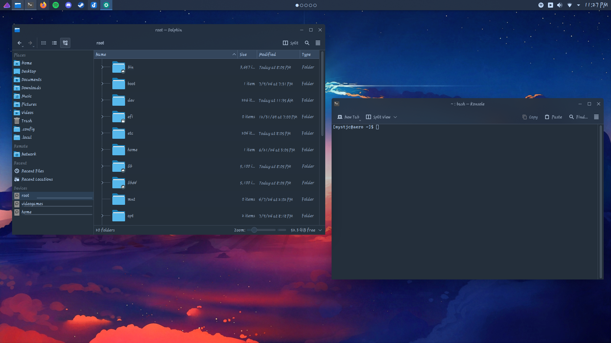

## KDE

Stylistic color scheme for [KDE](https://kde.org/)

## Installation

**System Color Scheme:**
- Download the file `Cobaltic.colors`
- Launch your terminal or file manager of choice
- Navigate to `~/.local/share/color-schemes/` and move the file into the directory

> ### Note
> - Recommended to restart your PC to ensure everything applies correctly
> - Use KColorSchemeEditor if you are interested in further modifying this theme
