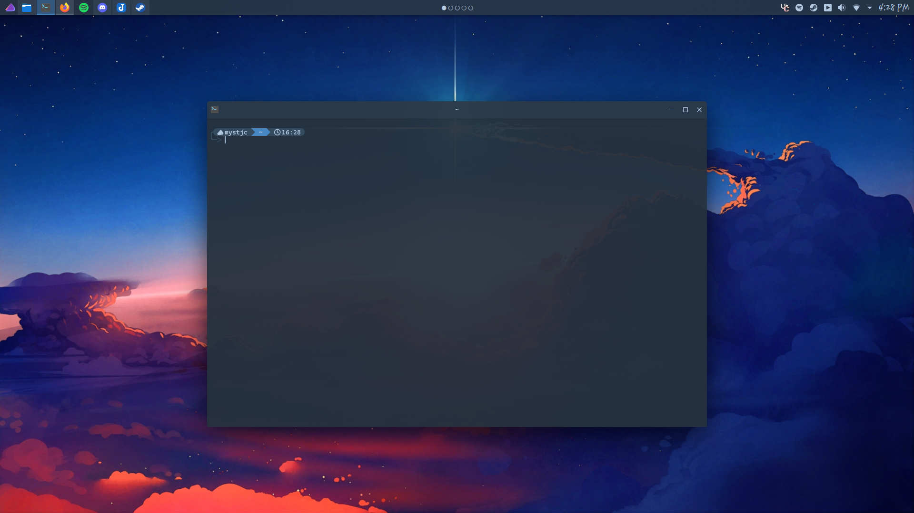

## Kitty

Stylistic color scheme for [Kitty](https://sw.kovidgoyal.net/kitty/)

## Installation

**Kitty:**
- Navigate to `~/.config/kitty/`
    - Move the file, `colorscheme.conf`, into the directory
- Open `kitty.conf` and add the line `include colorscheme.conf`

> ### Note
> - The changes won't apply until you restart the app
> - Use terminal.sexy if you are interested in further modifying this theme
