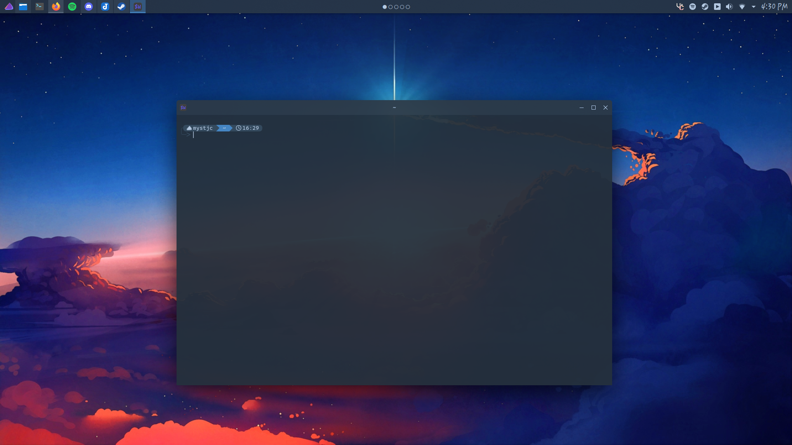

## WezTerm

Stylistic color scheme for [WezTerm](https://wezfurlong.org/wezterm/index.html)

## Installation

**WezTerm:**
- Navigate to `~/.config/wezterm/`
    - Move the file, `colorscheme.lua`, into the directory
- Open `wezterm.lua` and add the lines:
    - `local colorscheme = require 'colorscheme'`
    - `colorscheme.apply_colors(config)`

> ### Note
> - The changes will apply with the app open
> - Use terminal.sexy if you are interested in further modifying this theme
